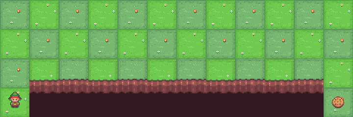
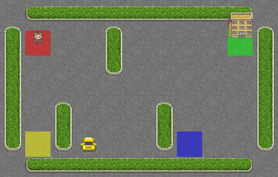

## Dynamic Programming for Tabular Reinforcement Learning

This repository presents a structured study of **classical Dynamic Programming (DP) methods** applied to **tabular reinforcement learning environments** using OpenAI Gym. The focus is on understanding how **Value Iteration** and **Policy Iteration** behave across environments with increasing complexity and different reward dynamics.

The project is intentionally designed to be algorithm-centric and reproducible, emphasizing exact planning methods under full knowledge of the environment dynamics.

---
## Environments

#### FrozenLake (Stochastic Dynamics)

* Small discrete state space
* Slippery transitions introduce stochasticity
* Sparse rewards

#### CliffWalking (Risk-Sensitive Rewards)

* Deterministic transitions
* Severe negative rewards for unsafe actions
* Highlights trade-offs between shortest path and risk avoidance

#### Taxi (Large Structured MDP)

* 500 discrete states
* Multi-stage task (navigation, pickup, drop-off)
* Sparse positive rewards with penalties for illegal actions

---
### Algorithms Implemented  
- **Value Iteration**: An iterative algorithm that updates the value function based on the Bellman optimality equation until convergence.  
- **Policy Iteration**: An algorithm that alternates between policy evaluation and policy improvement until the policy stabilizes.

---
### Usage 
Installation

1. Clone the repository:

```bash
git clone https://github.com/ariankhanjani/dynamic-programming-rl.git
cd dynamic_programming_rl
```


2. (Optional) Create a virtual environment:

```bash
python -m venv venv
source venv/bin/activate   # On Windows: venv\Scripts\activate
```


3. Install dependencies:

⚠ **Note:** These algorithms require access to the environment’s transition model (`P(s'|s,a)`) and reward function.  
For Gymnasium environments, you may need **Gym version 0.21** or **custom tabular environments**.

```bash
pip install -r requirements.txt
```
```python
# Import necessary functions
from algorithms.value_iteration import value_iteration
from algorithms.policy_iteration import policy_iteration

# -------------------------
# 1. Create Environment
# -------------------------
env = gym.make("FrozenLake-v1", is_slippery=True, map_name="4x4")
env.reset()


# -------------------------
# 1. Value Iteration
# -------------------------

# Run Value Iteration
policy_vi, V_vi, iterations_vi, time_taken_vi, deltas_vi = value_iteration(env, gamma=0.99, theta=1e-8, max_iterations=10000)
print("Value Iteration Completed")
print("VI State Values:\n", V_vi.reshape(int(np.sqrt(len(V_vi))), -1))


# -------------------------
# 2. Policy Iteration
# -------------------------

# Run Policy Iteration
policy_pi, V_pi, iterations_pi, time_taken_pi, deltas_pi = policy_iteration(env, gamma=0.99, theta=1e-8, max_iterations=10000)
print("Policy Iteration Completed")
print("PI State Values:\n", V_pi.reshape(int(np.sqrt(len(V_pi))), -1))
```

---
### Project Structure

```text
Dynamic-Programming-RL/
│
├── algorithms/
│   ├── value_iteration.py
│   └── policy_iteration.py
│
├── utils/
│   ├── utils.py
│
├── notebooks/
│   ├── frozenlake.ipynb
│   ├── cliffwalking.ipynb
│   └── taxi.ipynb
│
├── assets/
│   ├── frozenlake.gif
│   ├── cliffwalking.gif
│   └── taxi.gif
│
├── README.md
└── requirements.txt
```
---
### References
- Sutton, R. S., & Barto, A. G. (2018). *Reinforcement Learning: An Introduction* (2nd Edition). MIT Press.  
  Chapters 4 and 4.3 cover **Dynamic Programming**, including **Value Iteration** and **Policy Iteration**.  
  [Reinforcement Learning: An Introduction](http://incompleteideas.net/book/the-book-2nd.html)


